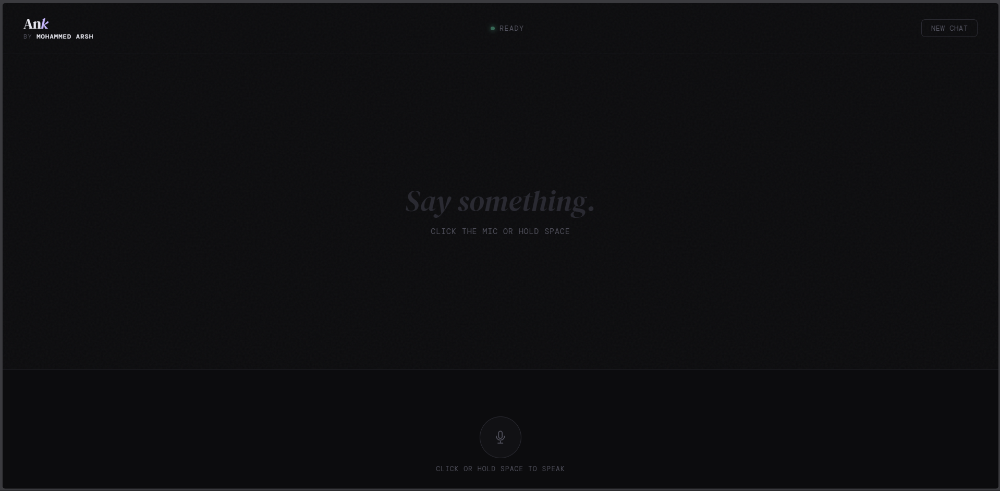

# Ank — AI Voice Assistant

> A full-stack conversational AI assistant with a speech interface, built with Python and a clean dark web UI.
> Speak naturally, get intelligent responses spoken back to you in real time.



---

## Live Demo

| Platform | Link | Status |
|---|---|---|
| 🚀 **Render** (primary) | [ank-voice-assistant.onrender.com](https://ank-voice-assistant.onrender.com) | Always on — kept alive via UptimeRobot |
| 🚄 **Railway** (backup) | [ank-voice-assistant.up.railway.app](https://ank-voice-assistant.up.railway.app) | Active until March 2026, then expires |

> **Note:** Render is the primary deployment, kept always on using UptimeRobot health checks. Railway is a backup that runs until the free trial expires in March 2026.

---

## Overview

Ank is a full-stack voice assistant that integrates speech recognition, large language model inference, and text-to-speech synthesis into a seamless conversational experience. Built to demonstrate end-to-end AI pipeline integration, from raw microphone audio to spoken AI responses, using production-grade APIs.

The system supports two modes — **OpenAI** (cloud, deployed) and **Local** (Ollama + faster-whisper, offline) — switchable with a single config change. It also includes session logging, live analytics and data export designed to support empirical human-AI interaction research.

**Live interaction flow:**

```
Your voice → Whisper STT → GPT-4o-mini → gTTS → Spoken response
```

---

## Features

- **Voice input** — Click the mic button or hold Spacebar to record
- **Real-time waveform** — Live symmetric audio visualizer while speaking
- **Conversational memory** — Remembers full session context across turns
- **Spoken responses** — Every reply converted to audio and played automatically
- **Chat history** — Full conversation displayed on screen with replay buttons
- **Session analytics** — Live stats: turn count, response times, session duration, token usage
- **Token tracking** — Tracks prompt, completion and total tokens per turn and per session
- **Data export** — Download session data as JSON or CSV for research analysis
- **Consent banner** — GDPR-aware data usage notice shown at the start of every session
- **Dual mode** — Switch between OpenAI APIs and fully local models
- **Mobile responsive** — Works on phones and tablets
- **Auto cleanup** — Temp audio files removed on startup, shutdown and reset

---

## Architecture

```
┌─────────────────────────────────────────────────────┐
│                    Browser (UI)                     │
│  MediaRecorder API → WAV blob → fetch(/chat)        │
│  ← JSON { user_text, reply, audio_url, analytics }  │
│  Audio() playback ← /audio/{file}                   │
│  Export ← /export/json  /export/csv                 │
└────────────────────┬────────────────────────────────┘
                     │ HTTP
┌────────────────────▼────────────────────────────────┐
│                FastAPI Backend                      │
│                                                     │
│  /chat                                              │
│    ├── audio/stt.py      (router → openai or local) │
│    ├── brain/memory.py   (multi-turn history)       │
│    ├── brain/llm.py      (router → openai or local) │
│    ├── brain/logger.py   (session logging)          │
│    └── audio/tts.py      (gTTS → MP3)               │
│                                                     │
│  /audio/{file}    serves generated MP3              │
│  /reset           clears memory, session, files     │
│  /export/json     downloads session as JSON         │
│  /export/csv      downloads session as CSV          │
│  /analytics       returns live session stats        │
└─────────────────────────────────────────────────────┘
```

**Component breakdown:**

| Component | File | Responsibility |
|---|---|---|
| Web UI | `static/index.html` | Recording, waveform, chat, analytics |
| API Server | `app.py` | Routing, session management, cleanup |
| STT Router | `audio/stt.py` | Routes to OpenAI or local Whisper |
| STT OpenAI | `audio/stt_openai.py` | Transcription via OpenAI Whisper API |
| STT Local | `audio/stt_local.py` | Transcription via faster-whisper locally |
| LLM Router | `brain/llm.py` | Routes to OpenAI or Ollama |
| LLM OpenAI | `brain/llm_openai.py` | GPT-4o-mini via OpenAI API + token tracking |
| LLM Local | `brain/llm_local.py` | Llama 3.2 via Ollama locally |
| Memory | `brain/memory.py` | Multi-turn conversation history |
| Logger | `brain/logger.py` | Session logging, token usage, JSON/CSV export |
| TTS | `audio/tts.py` | Text-to-speech via gTTS |

---

## Tech Stack

| Layer | Technology | Notes |
|---|---|---|
| Backend | Python 3.11, FastAPI, Uvicorn | Async REST API |
| Speech-to-Text | OpenAI Whisper API / faster-whisper | Cloud or local |
| LLM | GPT-4o-mini / Ollama + Llama 3.2 | Cloud or local |
| Text-to-Speech | gTTS | Google TTS, free |
| Frontend | Vanilla HTML / CSS / JS | No framework, single file |
| Audio Capture | Web MediaRecorder API | Browser-native |
| Deployment | Render + UptimeRobot / Railway | Auto-deploy from GitHub, always on via health check pings |

---

## Setup & Installation

### Prerequisites

- Python 3.11+
- OpenAI API key — [platform.openai.com/api-keys](https://platform.openai.com/api-keys) *(OpenAI mode)*
- [Ollama](https://ollama.com) installed *(local mode only)*
- [ffmpeg](https://ffmpeg.org/download.html) installed

### 1. Clone the repository

```bash
git clone https://github.com/MohammeddArsh/ank-voice-assistant
cd ank-voice-assistant
```

### 2. Create a virtual environment

```bash
python -m venv .venv

# Windows
.venv\Scripts\activate

# Mac / Linux
source .venv/bin/activate
```

### 3. Install dependencies

```bash
pip install -r requirements.txt
```

### 4. Configure mode

Open `config.py` and set your preferred mode:

```python
MODE = "openai"   # "openai" = GPT-4o-mini + Whisper API
                  # "local"  = Llama 3.2 + faster-whisper (no API key needed)
```

### 5. Add your API key *(OpenAI mode only)*

Create a `.env` file in the project root:

```
OPENAI_API_KEY=sk-your-key-here
```

### 6. Configure ffmpeg *(local playback only)*

Open `audio/tts.py` and update the path:

```python
FFMPEG_DIR = r"C:\path\to\ffmpeg\bin"   # Windows
# FFMPEG_DIR = "/usr/local/bin"         # Mac / Linux
```

### 7. Pull the Llama model *(local mode only)*

```bash
ollama pull llama3.2
```

### 8. Run the server

```bash
uvicorn app:app --reload
```

### 9. Open in browser

```
http://localhost:8000
```

---

## Project Structure

```
ank-voice-assistant/
├── app.py                  # FastAPI server, endpoints, temp file cleanup
├── config.py               # Mode switch, API keys, model settings
├── requirements.txt
├── railway.json            # Railway deployment config
├── render.yaml             # Render deployment config
├── static/
│   └── index.html          # Full web UI — single file
├── audio/
│   ├── stt.py              # STT router
│   ├── stt_openai.py       # Whisper API
│   ├── stt_local.py        # faster-whisper (local)
│   └── tts.py              # Text-to-speech via gTTS
└── brain/
    ├── llm.py              # LLM router
    ├── llm_openai.py       # GPT-4o-mini + token usage tracking
    ├── llm_local.py        # Llama 3.2 via Ollama
    ├── memory.py           # Conversation history
    └── logger.py           # Session logging, token tracking, data export
```

---

## API Endpoints

| Method | Endpoint | Description |
|---|---|---|
| `GET` | `/` | Serves the web UI |
| `POST` | `/chat` | Accepts audio, returns transcript + reply + audio URL + analytics |
| `GET` | `/audio/{file}` | Serves generated TTS audio |
| `POST` | `/reset` | Clears memory, session and temp files |
| `GET` | `/analytics` | Returns live session analytics |
| `GET` | `/export/json` | Downloads full session as JSON |
| `GET` | `/export/csv` | Downloads session turns as CSV |

---

## Research & Data Collection

Each session is automatically logged to `logs/session_YYYYMMDD_HHMMSS.json` containing:

- Full turn-by-turn conversation history
- Timestamps for every message
- Response latency per turn (ms)
- Token usage per turn — prompt, completion and total
- Aggregated session statistics

Sessions can be exported directly from the UI as **JSON** or **CSV** for offline analysis. This is designed to support empirical studies on human-AI dialogue interaction — tracking conversation patterns, response latency, token consumption and turn-taking behaviour across sessions.

---

## Privacy & Ethics

- A consent banner is shown at the start of every session explaining data usage clearly
- Voice audio is sent to OpenAI Whisper API for transcription
- Conversation text is sent to GPT-4o-mini to generate responses
- No data is stored permanently on the server
- Session logs are saved locally only and never shared with third parties
- The local mode option allows fully offline operation with zero data leaving the device
- Users can decline consent — no data is collected if declined

---

## Built by

**Mohammed Arsh** — [github.com/MohammeddArsh](https://github.com/MohammeddArsh)
